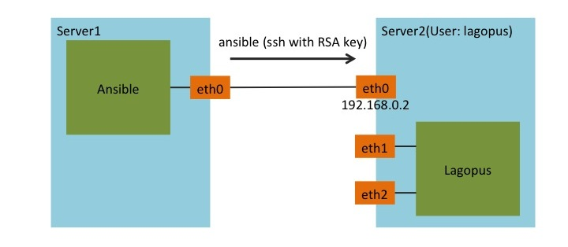
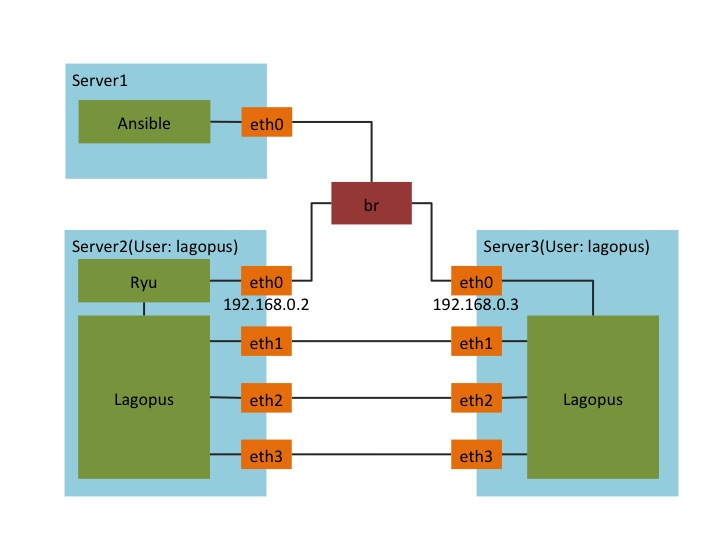

# AnsibleによるLagopus環境の構築

Ansibleを用いたDPDK, Lagopus, Ryuの自動インストール、及び、Hugepages, NICの設定を行う。  
以下の手順で構築する。

1. サーバ設定
2. playbookの設定
3. Ansibleの実行

## サーバ設定

以下のようなサーバ構成を想定する。管理ホストからAnsibleを用いて対象ホストにLaogpus環境の構築を行う．



- 管理ホスト（Ansible 実行サーバ）
  - ssh, ansibleがインストールされている
  - このREADMEが含まれるAnsibleディレクトリが保存されている
- 対象ホスト
  - sudoが行えるユーザ(lagopus)に対し、管理ホストから鍵認証によるssh接続が行える

## Playbookの設定

管理ホストでinventories/hosts_setup, playbooks/vars.ymlファイルを設定する。

hosts_setupに対象ホストのIPアドレスを設定する。

```bash
$ cd lagopus-tools/ansible
$ echo "[target]" > inventories/hosts_setup
$ echo "192.168.0.2" >> inventories/hosts_setup
```

vars.ymlに対象ホストの作業ディレクトリ, ユーザ名, Lagopusに割り当てるNICを設定する。
作業ディレクトリにはインストールに必要なファイルがダウンロードされる。

```bash
$ echo "work_dir: /home/lagopus" > playbooks/vars.yml
$ echo "user: lagopus" >> playbooks/vars.yml
```


## デプロイ

これまでの設定を用いてAnsibleによる自動インストールを行う。
以下のコマンドを実行すると、対象ホストのユーザlagopusのsudoパスワードを求められるので入力する。

```bash
$ ansible-playbook -i inventories/hosts_setup playbooks/setup.yml -K
```

sudoパスワードが不要な場合、[-K]オプションは不要である。


-----

# sample: Ryu Certification

以下の手順でRyu certificationの環境を構築する．

1. サーバ設定
2. playbookの設定
3. Ansibleの実行

## Serverの環境設定

以下のようなサーバ構成を想定する。管理ホストからAnsibleを用いて対象ホストにLaogpus環境の構築を行う．



- 管理ホスト
  - ssh, Ansibleがインストールされている．Ansibleのインストールは[Ansible documentation](http://docs.ansible.com/intro_installation.html)を参考にする．
  - このREADMEが含まれるAnsibleディレクトリが保存されている
- 対象ホスト1,2
  - sudoが行えるユーザ(lagopus)に対し、管理ホストから鍵認証によるssh接続が行える

また、対象ホスト1,2でそれぞれ対応するNICが同一ネットワーク上に存在する必要がある。

## Ansibleの設定変更

管理ホストでinventories/hosts_ryu_certification, playbooks/vars.yml, laybooks/vars_ryu.ymlファイルを設定する。

hosts_ryu_certificationに対象ホスト1, 2のIPアドレスを書き込む。

```bash
$ cd ansible
$ echo "[Server2]" > inventories/hosts_ryu_certification
$ echo "192.168.0.2" >> inventories/hosts_ryu_certification
$ echo "[Server3]" >> inventories/hosts_ryu_certification
$ echo "192.168.0.3" >> inventories/hosts_ryu_certification
```

vars_ryu.ymlにServer2, Server3の作業ディレクトリ, ユーザ名, Lagopusに割り当てるNICを設定する。

```bash
$ echo "work_dir: /home/lagopus" > playbooks/vars.yml
$ echo "user: lagopus" >> playbooks/vars.yml
```

vars_ryu.ymlにRyu-Certificationで利用するインターフェースを設定する．

```bash
$ echo "networks:" > playbooks/vars_ryu.yml
$ echo "  - iface: eth1" >>  playbooks/vars_ryu.yml
$ echo "  - iface: eth2" >>  playbooks/vars_ryu.yml
$ echo "  - iface: eth3" >>  playbooks/vars_ryu.yml
```

## Ansibleによる自動インストール

以下のコマンドによって、自動インストールを行う。

```bash
$ ansible-playbook -i inventories/hosts_ryu_certification playbooks/ryu_certification.yml -K
```
